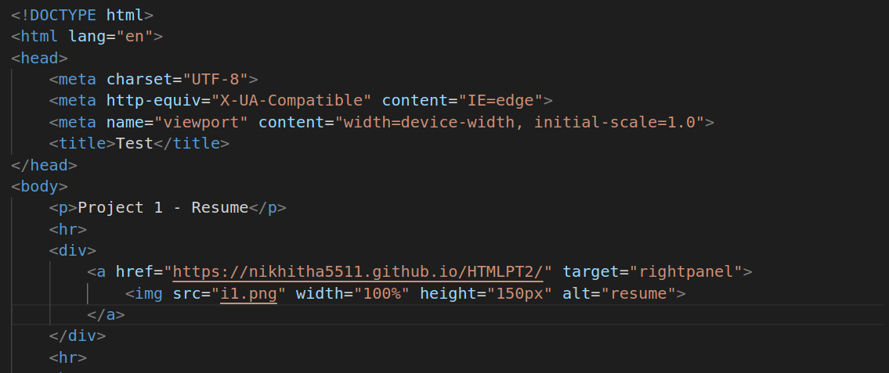

# HTML
1.
##### Explanation
* scrolling Attribute:
The scrolling attribute controls whether scrollbars are displayed within the iframe when the content inside it is larger than the iframe's dimensions. It can take one of three values:

   * "yes": Display both horizontal and vertical scrollbars.
   * "no": Do not display any scrollbars, even if the content is larger.
   * "auto": Display scrollbars only if the content overflows the iframe's dimensions.
* iframe is an inline elemnt that allows us to embed another document or webpage within the current document.

2.
##### Explanation
* p tag is used for paragraph text
* hr tag is used for line break
* The target attribute specifies a name or a keyword that indicates where to display the response that is received after submitting the form.
* img tag creates a holding space for the referenced image.
* src tag Specifies the path to the image. 
* alt tag Specifies an alternate text for the image, if the image for some reason cannot be displayed

3.
##### Explanation
* p tag is used for paragraph text
* hr tag is used for line break
* The target attribute specifies a name or a keyword that indicates where to display the response that is received after submitting the form.
* img tag creates a holding space for the referenced image.
* src tag Specifies the path to the image. 
* alt tag Specifies an alternate text for the image, if the image for some reason cannot be displayed

* Here in content.html file i have created content for iframe-1 and I have set target to frane-2
* In index.html I have created frames with some width and height.